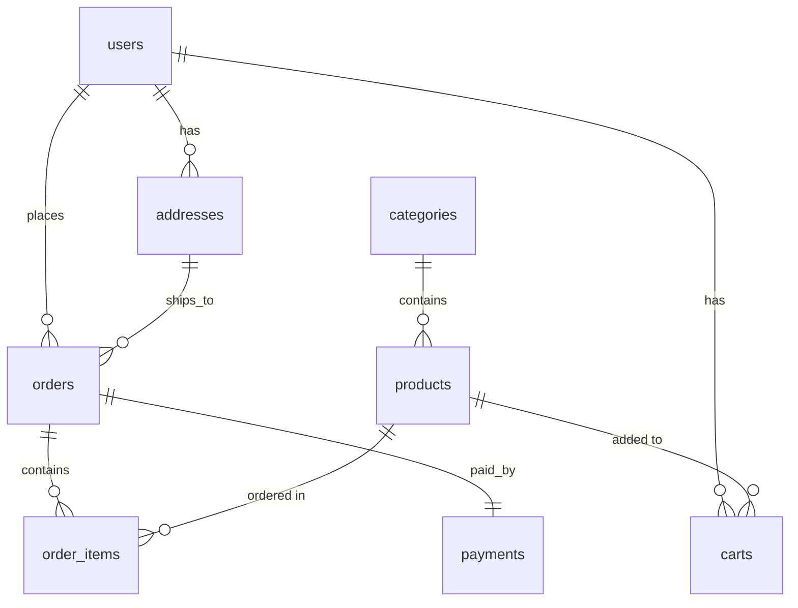

# Ecommerce API

A RESTful API for an e-commerce application built with **Laravel 13** and **Laravel Sanctum**. It provides token-based authentication, role-based access control (admin / customer), and CRUD endpoints for categories and products.

---

## Table of Contents

- [Tech Stack](#tech-stack)
- [Features](#features)
- [Requirements](#requirements)
- [Installation](#installation)
- [Environment Configuration](#environment-configuration)
- [Database Schema](#database-schema)
- [Running the API](#running-the-api)
- [Authentication](#authentication)
- [Roles & Access Control](#roles--access-control)
- [API Endpoints](#api-endpoints)
  - [Auth](#auth-endpoints)
  - [Categories](#category-endpoints)
  - [Products](#product-endpoints)
- [Testing with Postman](#testing-with-postman)
- [Project Structure](#project-structure)
- [License](#license)

---

## Tech Stack

| Component     | Version / Tool                |
| ------------- | ----------------------------- |
| Framework     | Laravel 13                    |
| Auth          | Laravel Sanctum 4.3 (tokens)  |
| PHP           | ^8.3                          |
| Database      | MySQL                         |
| Testing       | PHPUnit 12 / Postman          |

---

## Features

- **Token-based authentication** via Sanctum (register, login, logout).
- **Token management**: refresh token, logout from all devices.
- **Profile management**: view/update profile, change password.
- **Role-based access control**: `admin` and `customer` roles.
- **Admin middleware** protecting all write operations.
- **Category CRUD** with automatic slug generation.
- **Product CRUD** with categories eager-loaded.
- **Public read-only** access to categories and products.
- **Rate limiting** on auth endpoints (brute-force protection).
- **Consistent JSON responses** (401 / 403 / 422) for API clients.

---

## Requirements

- PHP >= 8.3
- Composer
- MySQL (e.g. via [Laragon](https://laragon.org/) or XAMPP)
- Node.js & npm (optional, only for the Vite frontend assets)

---

## Installation

```bash
# 1. Clone the repository
git clone <repository-url>
cd ecommerce-api

# 2. Install PHP dependencies
composer install

# 3. Copy the environment file
copy .env.example .env        # Windows
# cp .env.example .env        # macOS / Linux

# 4. Generate the application key
php artisan key:generate

# 5. Configure your database in .env (see below)

# 6. Run migrations
php artisan migrate

# 7. (Optional) Install frontend dependencies
npm install
```

---

## Environment Configuration

Update the following values in your `.env` file to match your local database:

```dotenv
APP_NAME="Ecommerce API"
APP_URL=http://127.0.0.1:8000

DB_CONNECTION=mysql
DB_HOST=127.0.0.1
DB_PORT=3306
DB_DATABASE=ecommerce-apps
DB_USERNAME=root
DB_PASSWORD=
```

> The default `.env.example` uses SQLite. Switch `DB_CONNECTION` to `mysql` for the schema described below.

---

## Database Schema

The application contains the following tables:

| Table                   | Description                                        |
| ----------------------- | -------------------------------------------------- |
| `users`                 | Accounts with a `role` (`admin` / `customer`)       |
| `addresses`             | User shipping/billing addresses                     |
| `categories`            | Product categories (unique slug)                    |
| `products`              | Products belonging to a category                    |
| `carts`                 | User cart items                                     |
| `orders`                | Customer orders                                     |
| `order_items`           | Line items within an order                          |
| `payments`              | Payment records per order                           |
| `personal_access_tokens`| Sanctum API tokens                                  |

### Entity Relationship Diagram



---

## Running the API

```bash
php artisan serve
```

The API will be available at `http://127.0.0.1:8000/api`.

> With Laragon you can also use the pretty URL configured in your virtual hosts.

---

## Authentication

The API uses **Bearer tokens** issued by Sanctum.

1. **Register** or **Login** to receive a `token`.
2. Send the token in the `Authorization` header on protected requests:

```
Authorization: Bearer <your-token>
```

3. Always send `Accept: application/json` so errors return JSON (401/403/422) instead of HTML redirects.

---

## Roles & Access Control

| Role       | Permissions                                                            |
| ---------- | --------------------------------------------------------------------- |
| `customer` | Read categories/products, manage own profile.                          |
| `admin`    | Everything a customer can do **plus** create/update/delete categories & products. |
| Guest      | Read-only access to categories and products.                          |

Access is enforced by the `admin` middleware (`app/Http/Middleware/AdminMiddleware.php`):

- Returns **401** when unauthenticated.
- Returns **403** when authenticated but not an admin.

---

## API Endpoints

Base URL: `POST {{baseUrl}}/api/...` — all requests should include `Accept: application/json`.

### Auth Endpoints

| Method | Endpoint               | Access | Description                          |
| ------ | ---------------------- | ------ | ------------------------------------ |
| POST   | `/api/register`        | Public | Register a new user                  |
| POST   | `/api/login`           | Public | Login and receive a token            |
| GET    | `/api/user`            | Auth   | Get the authenticated user's profile |
| PUT    | `/api/user`            | Auth   | Update profile (name / email)        |
| PUT    | `/api/user/password`   | Auth   | Change password                      |
| POST   | `/api/logout`          | Auth   | Revoke the current token             |
| POST   | `/api/logout-all`      | Auth   | Revoke all tokens (all devices)      |
| POST   | `/api/refresh-token`   | Auth   | Revoke current token, issue new one  |

**Register** — `POST /api/register`

```json
{
  "name": "John Doe",
  "email": "john@example.com",
  "password": "password123",
  "password_confirmation": "password123",
  "role": "customer"
}
```

**Login** — `POST /api/login`

```json
{
  "email": "john@example.com",
  "password": "password123"
}
```

**Success response** (both register & login):

```json
{
  "user": {
    "id": 1,
    "name": "John Doe",
    "email": "john@example.com",
    "role": "customer"
  },
  "token": "1|abcdef123456..."
}
```

**Change Password** — `PUT /api/user/password`

```json
{
  "current_password": "password123",
  "password": "newpassword123",
  "password_confirmation": "newpassword123"
}
```

---

### Category Endpoints

| Method    | Endpoint                     | Access | Description                     |
| --------- | ---------------------------- | ------ | ------------------------------- |
| GET       | `/api/categories`            | Public | List all categories             |
| GET       | `/api/categories/{id}`       | Public | Show a single category          |
| POST      | `/api/categories`            | Admin  | Create a category               |
| PUT/PATCH | `/api/categories/{id}`       | Admin  | Update a category               |
| DELETE    | `/api/categories/{id}`       | Admin  | Delete a category               |

**Create / Update body**

```json
{
  "name": "Electronics",
  "slug": "electronics",
  "image": "categories/electronics.jpg",
  "description": "All electronics and gadgets"
}
```

> `slug` is optional — it is auto-generated from `name` when omitted.

---

### Product Endpoints

| Method    | Endpoint                | Access | Description                             |
| --------- | ----------------------- | ------ | --------------------------------------- |
| GET       | `/api/products`         | Public | List all categories with their products |
| GET       | `/api/product/{id}`     | Public | Show a single product (with category)   |
| POST      | `/api/product`          | Admin  | Create a product                        |
| PUT/PATCH | `/api/product/{id}`     | Admin  | Update a product                        |
| DELETE    | `/api/product/{id}`     | Admin  | Delete a product                        |

**Create / Update body**

```json
{
  "category_id": 1,
  "name": "Wireless Mouse",
  "slug": "wireless-mouse",
  "description": "Ergonomic wireless mouse",
  "price": 29.99,
  "offer_price": 24.99,
  "image": "products/mouse.jpg",
  "stock": 50,
  "is_featured": true
}
```

---

## Testing with Postman

A ready-to-import Postman collection and environment are included:

- `postman/Ecommerce-API.postman_collection.json`
- `postman/Ecommerce-API-Local.postman_environment.json`

### Import Steps

1. Open Postman → **Import** → select both files.
2. Select the **Ecommerce API - Local** environment.
3. Set the `baseUrl` variable (default `http://127.0.0.1:8000`).

### Recommended Run Order

1. **Auth → Register Admin** and **Auth → Register Customer**
   *(tokens are saved automatically to collection variables)*
2. **Categories → Create Category (Admin)**
   *(saves `category_id`)*
3. **Products → Create Product (Admin)**
   *(saves `product_id`)*
4. Then run any list/show/update/delete request.

The collection includes negative tests that assert `401` (guest) and `403` (customer) responses, so you can verify role-based access directly from Postman's **Test Results**.

---

## Project Structure

```
app/
├── Http/
│   ├── Controllers/
│   │   ├── AuthController.php       # Register, login, logout, profile
│   │   ├── CategoryController.php   # Category CRUD
│   │   └── ProductController.php    # Product CRUD
│   └── Middleware/
│       └── AdminMiddleware.php      # Restricts writes to admins
└── Models/
    ├── User.php
    ├── Address.php
    ├── Category.php
    ├── Product.php
    ├── Cart.php
    ├── Order.php
    ├── OrderItem.php
    └── Payment.php

database/
└── migrations/                      # All table definitions

routes/
└── api.php                          # API route definitions

postman/                             # Postman collection + environment
```

---

## License

This project is open-sourced software licensed under the [MIT license](https://opensource.org/licenses/MIT).
